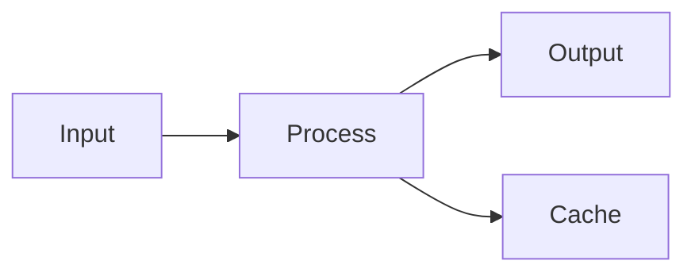

# Obsidian Flavored Markdown Skill

This skill enables skills-compatible agents to create and edit valid Obsidian Flavored Markdown, including all Obsidian-specific syntax extensions.

## Overview

Obsidian uses a combination of Markdown flavors:
- [CommonMark](https://commonmark.org/)
- [GitHub Flavored Markdown](https://github.github.com/gfm/)
- [LaTeX](https://www.latex-project.org/) for math
- Obsidian-specific extensions (wikilinks, callouts, embeds, etc.)

## Standard Markdown

For basic formatting (headings, bold/italic, lists, tables, code blocks, math, Mermaid diagrams, footnotes, HTML), see `references/standard-syntax.md`.

Obsidian-specific extensions are documented below.

## Internal Links (Wikilinks)

### Basic Links

```markdown
[[Note Name]]
[[Note Name.md]]
[[Note Name|Display Text]]
```

### Link to Headings

```markdown
[[Note Name#Heading]]
[[Note Name#Heading|Custom Text]]
[[#Heading in same note]]
[[##Search all headings in vault]]
```

### Link to Blocks

```markdown
[[Note Name#^block-id]]
[[Note Name#^block-id|Custom Text]]
```

Define a block ID by adding `^block-id` at the end of a paragraph:
```markdown
This is a paragraph that can be linked to. ^my-block-id
```

For lists and quotes, add the block ID on a separate line:
```markdown
> This is a quote
> With multiple lines

^quote-id
```

### Search Links

```markdown
[[##heading]]     Search for headings containing "heading"
[[^^block]]       Search for blocks containing "block"
```

## Embeds

### Embed Notes

```markdown
![[Note Name]]
![[Note Name#Heading]]
![[Note Name#^block-id]]
```

### Embed Images

```markdown
![[image.png]]
![[image.png|640x480]]    Width x Height
![[image.png|300]]        Width only (maintains aspect ratio)
```

### External Images

```markdown


```

### Embed Audio

```markdown
![[audio.mp3]]
![[audio.ogg]]
```

### Embed PDF

```markdown
![[document.pdf]]
![[document.pdf#page=3]]
![[document.pdf#height=400]]
```

### Embed Lists

```markdown
![[Note#^list-id]]
```

Where the list has been defined with a block ID:
```markdown
- Item 1
- Item 2
- Item 3

^list-id
```

### Embed Search Results

````markdown
```query
tag:#project status:done
```
````

## Callouts

### Basic Callout

```markdown
> [!note]
> This is a note callout.

> [!info] Custom Title
> This callout has a custom title.

> [!tip] Title Only
```

### Foldable Callouts

```markdown
> [!faq]- Collapsed by default
> This content is hidden until expanded.

> [!faq]+ Expanded by default
> This content is visible but can be collapsed.
```

### Nested Callouts

```markdown
> [!question] Outer callout
> > [!note] Inner callout
> > Nested content
```

### Supported Callout Types

| Type | Aliases | Description |
|------|---------|-------------|
| `note` | - | Blue, pencil icon |
| `abstract` | `summary`, `tldr` | Teal, clipboard icon |
| `info` | - | Blue, info icon |
| `todo` | - | Blue, checkbox icon |
| `tip` | `hint`, `important` | Cyan, flame icon |
| `success` | `check`, `done` | Green, checkmark icon |
| `question` | `help`, `faq` | Yellow, question mark |
| `warning` | `caution`, `attention` | Orange, warning icon |
| `failure` | `fail`, `missing` | Red, X icon |
| `danger` | `error` | Red, zap icon |
| `bug` | - | Red, bug icon |
| `example` | - | Purple, list icon |
| `quote` | `cite` | Gray, quote icon |

### Custom Callouts (CSS)

```css
.callout[data-callout="custom-type"] {
  --callout-color: 255, 0, 0;
  --callout-icon: lucide-alert-circle;
}
```

## Properties (Frontmatter)

Properties use YAML frontmatter at the start of a note:

```yaml
---
title: My Note Title
date: 2024-01-15
tags:
  - project
  - important
aliases:
  - My Note
  - Alternative Name
cssclasses:
  - custom-class
status: in-progress
rating: 4.5
completed: false
due: 2024-02-01T14:30:00
---
```

### Property Types

| Type | Example |
|------|---------|
| Text | `title: My Title` |
| Number | `rating: 4.5` |
| Checkbox | `completed: true` |
| Date | `date: 2024-01-15` |
| Date & Time | `due: 2024-01-15T14:30:00` |
| List | `tags: [one, two]` or YAML list |
| Links | `related: "[[Other Note]]"` |

### Default Properties

- `tags` - Note tags
- `aliases` - Alternative names for the note
- `cssclasses` - CSS classes applied to the note

## Tags

```markdown
#tag
#nested/tag
#tag-with-dashes
#tag_with_underscores

In frontmatter:
---
tags:
  - tag1
  - nested/tag2
---
```

Tags can contain:
- Letters (any language)
- Numbers (not as first character)
- Underscores `_`
- Hyphens `-`
- Forward slashes `/` (for nesting)

## Complete Example

````markdown
---
title: Project Alpha
date: 2024-01-15
tags:
  - project
  - active
status: in-progress
priority: high
---

# Project Alpha

## Overview

This project aims to [[improve workflow]] using modern techniques.

> [!important] Key Deadline
> The first milestone is due on ==January 30th==.

## Tasks

- [x] Initial planning
- [x] Resource allocation
- [ ] Development phase
  - [ ] Backend implementation
  - [ ] Frontend design
- [ ] Testing
- [ ] Deployment

## Technical Notes

The main algorithm uses the formula $O(n \log n)$ for sorting.

```python
def process_data(items):
    return sorted(items, key=lambda x: x.priority)
```

## Architecture



## Related Documents

- ![[Meeting Notes 2024-01-10#Decisions]]
- [[Budget Allocation|Budget]]
- [[Team Members]]

## References

For more details, see the official documentation[^1].

[^1]: https://example.com/docs

%%
Internal notes:
- Review with team on Friday
- Consider alternative approaches
%%
````

## References

- [Basic formatting syntax](https://help.obsidian.md/syntax)
- [Advanced formatting syntax](https://help.obsidian.md/advanced-syntax)
- [Obsidian Flavored Markdown](https://help.obsidian.md/obsidian-flavored-markdown)
- [Internal links](https://help.obsidian.md/links)
- [Embed files](https://help.obsidian.md/embeds)
- [Callouts](https://help.obsidian.md/callouts)
- [Properties](https://help.obsidian.md/properties)